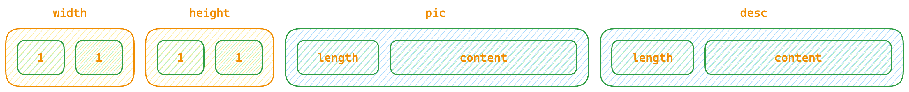

# websocket 发送二进制数据实践

## 为什么使用使用二进制传递数据

作为一名老前端，平时在工作中，接触到最多的网络数据传递（非图片/视频）基本都以文本格式传递。比如一个数据接口的返回值通常是JSON格式、HTML、JS、CSS资源文件的返回这些统统都是文本格式的数据。通过文本格式传输的数据简单、易于读取、不需要经过解码操作就能直接展示这都是他的优点。那为啥我们还需要使用二进制传递数据呢？原因也很简单比如说我们现在要从服务器发送一张图片资源到用户浏览器，如果不使用二进制传递数据，而使用文本格式那么首先我们需要在服务器上件图片文件编码为BASE64或者其他的文本格式数据，再将文本数据通过网络发送，浏览器收到数据后再从文本数据转换为对应的二进制图片进行下一步处理。在这个过程中存在以下几个方面的弊端：

+ 二进制数据在服务端进行编码后传输会增大数据体积，以base64为例，平均体积会增加33%，也就是说1kb的数据会增加到1.33kb;
+ 需要进行额外的编码和解码流程，增加了系统压力和复杂度；
+ 对服务端和客户端性能有负面影响

## 为什么要在websocket上进行二进制数据传输

类比以上使用二进制数据进行传输的好处，在ws上进行二进制数据传输获得的收益也是相同。而且基于ws协议使用场景，往往都是数据交换频率高，数据量大，使用二进制进行数据传输对带宽和性能所能带来的提升更加明显。

## 如何在ws中进行二进制数据传输

传输数据首先是一个双向的行为，分为发送端和接收端。从ws的二进制数据发送也是如此，首先我们来看看发送端是如何进行二进制数据的发送，直接上代码(以Deno为例)。

```typescript

Deno.serve({
  port: 80,
  handler: async (request) => {
    if (request.headers.get("upgrade") === "websocket") {
      const { socket, response } = Deno.upgradeWebSocket(request);

      socket.onopen = () => {
        console.log("CONNECTED");
      };

      socket.onmessage = (event) => {
        if(event.data === 'get_binary') {
            const file = Deno.readFileSync('./test.png');
            socket.send(file)
        }
      };

      socket.onclose = () => console.log("DISCONNECTED");
      socket.onerror = (error) => console.error("ERROR:", error);

      return response;
    } else {
      // If the request is a normal HTTP request,
      // we serve the client HTML file.
      const file = await Deno.open("./index.html", { read: true });
      return new Response(file.readable);
    }
  },
});

```
上面这段代码非常简单，Deno启动一个监听80端口的server，如果请求头上带有`upgrade` 标识为`websocket` 则进入ws的建立流程，然后进行一系列的事件监听初始化，这里涉及到二进制数据传输的地方就是读取图片数据然后通过`socket` 连接进行发送。

然后我们再看看客户端上如何读取这个二进制数据并展示,老规矩还是先上代码。

```typescript
  import { useEffect } from 'react';

  function App() {
    const ws = useRef<Websocket>(new WebSocket("ws://localhost:80"));
    const [img,setImg] = useState<string>('');

    useEffect(() => {
      if(ws.current) {

        ws.current.binaryType = 'blob';

        ws.current.onopen = (e) => {
          ws.current.send('CONNECTED');
        }
        ws.current.onclose = (e) => {
          ws.current.send('CLOSE');
        }
        ws.current.onmessage = (e) => {
          if(e.data instanceof Blob) {
            const url = URL.createObjectURL(e.data);
            setImg(url);
          }
        }
      }
    }, [])

    return <div>
      
    </div>
    
  }

  export default App;

```

上面这个代码很简单，就是建立一个长链的连接然后监听`open` `close` `message` 方法然后在message方法里面对binary数据进行处理。

## 难道ws中的二进制数据传输仅仅就是用来进行图片/视频等数据传输吗？

如果ws只是用来传递单个图片、视频等二进制数据，那么也太鸡肋了。假如我们有以下数据结构

```json
  {
    "width": 100,
    "height": 100,
    "pic": "https://xxxxxx.bass.ddd",
    "desc": "beauty girl"
  }

```
如何用二进制数据传输以上JSON格式表示的内容呢？

如果要将以上JSON数据转换为二进制，我们首先需要做的就是进行以下数据结构的分析，从数据格式上来看，原始的数据主要为两种数据格式也即`Number`和`String`。如果要将以上格式转换为二进制，那么主要需要解决的问题就是`String`转换为`Binary`。

如果要将字符串转换为二进制就需要知道文本在计算机上的编码原理，简单来讲就是有一套统一的文本到数字的映射规范，世界上每一个文本字符都有一个对应的码位。主流的编码格式有UTF-8和UTF-16。这里考虑到在JS中getCharCodeAt获取的编码格式为UTF-16，我们统一使用UTF-16作为值。

首先我们分析下上述数据如果存储为二进制格式需要的数据结构为什么样子。首先`width`和`height`,我们可以假定其值不超过10000,且为正。那么可以用2个字节来存储其值，这样width和height就占据总共4个字节长度。剩下的`pic`和`desc`，由于是字符串类型，其长度是可变的，在存储具体值之前要先把它的长度信息进行预先存储。根据以上信息我们可以得到以下数据结构。



下面来看看具体转换实现如何，代码如下

```typescript
   const data =   {
    "width": 100,
    "height": 100,
    "pic": "https://xxxxxx.bass.ddd",
    "desc": "beauty girl"
   }

   const getBinaryLength = (Obj: typeof data) => {
     // 首先加上width和height的长度,以及pic和desc的size长度
     const length = 8;
     // pic 和 desc 都是字符串，这里我们会用utf-16进行编码，一个字符会占用两个字节，所以需要乘以2。
     const picLength = Obj.pic.length * 2;
     const descLength = Obj.desc.length * 2;
     return length + picLength + descLength;                  
   }

   const length = getBinaryLength(data);

   // 根据计算的数据大小创建一个对应大小的buffer
   const buffer = new DataView(new ArrayBuffer(length));

   // 写入widht、height
   buffer.setUint16(0,data.width);
   buffer.setUint16(2,data.height);
   // 写入pic的长度信息
   buffer.setUint16(4,data.pic.length);

   // 遍历pic字符，写入pic数据
   for(let i = 0; i < data.pic.length; i++) {
     buffer.setUint16(i * 2 + 6, data.pic.charCodeAt(i))
   }

   // 写入desc的的长度信息
   buffer.setUint16((data.pic.length) * 2 + 6, data.desc.length);

   // 遍历desc字符，写入desc数据
   for(let i = 0; i < data.desc.length; i++) {
     buffer.setUint16(i * 2 + ((data.pic.length) * 2 + 6 + 2), data.desc.charCodeAt(i))
   }
  
   // 发送buffer
   socket.send(buffer) 

```

上面是服务端发送二进制数据的方法，下面来看看客户端如何接收二进制数据并解析

```typescript

  export default function App() {
  const ws = useRef(new WebSocket("ws://localhost:80"));

  useEffect(() => {
    if (ws.current) {
      // 声明接收到的二进制数据返回格式为arraybuffer,如果不指定返回的是blob
      ws.current.binaryType = "arraybuffer";
      ws.current.addEventListener("message", async (ev) => {
        const data = ev.data;
        if (ev.data instanceof ArrayBuffer) {
          const view = new DataView(ev.data);
          // 获取width/height字段值
          const width = view.getUint16(0);
          const height = view.getUint16(2);
          // 获取pic字段的长度信息
          const picLength = view.getUint16(4);

          // 获取pic字段值
          let pic = "";
          for (let i = 0; i < picLength; i++) {
            const code = view.getUint16(i * 2 + 6);
            pic += String.fromCharCode(code);
          }
          // 获取desc字段的长度信息
          const descLength = view.getUint16(6 + picLength * 2);

          // 获取desc字段值
          let desc = "";

          for (let i = 0; i < descLength; i++) {
            const code = view.getUint16(i * 2 + picLength * 2 + 8);
            desc += String.fromCharCode(code);
          }

          console.log(width, height, picLength, pic, descLength, desc);
                  
          }
      });
    }
  }, []);

  const handleGetBinarry = () => {
    ws.current?.send("get_binary");
  };

  return (
    <div className="App">
      <button onClick={handleGetBinarry}>get binnary from ws</button>
    </div>
  );
}

```
## 可优化的点

看了上面这个发送二进制和解析二进制的例子后相信大家对如何通过ws发送和解析二进制数据有了初步的了解，不知道大家有没有发现上述例子不论是在编码发送二进制数据还是解码获取二进制数据的时候，都比较繁琐。对于这些繁琐的读写操作应该要单独抽出并进行优化的。

```typescript
  class Binary {
    private view: DataView;
    private iota:number = 0;
    constructor(buffer: ArrayBuffer | DataView) {
      if(buffer instanceof ArrayBuffer) {
        this.view = new DataView(buffer);
      } else {
        this.view = buffer
      }
    }
    public getBuffer() {
      return this.view
    }
    public writeUint8(data: number) {
      this.view.setUint8(this.iota, data);
      this.iota += 1
    }
    public writeUin16(data:number) {
      this.view.setUint16(this.iota, data);
      this.iota += 2
    }
    public readUint8(data: number) {
      this.view.setUint8(this.iota, data);
      this.iota += 1
    }
    public readUin16(data:number) {
      this.view.setUint16(this.iota, data);
      this.iota += 2
    }
  }

```

通过构造上述方法类，能便于我们读写二进制数据并处理。

## 结语

ws通过二进制传输数据确实能极大的提高带宽利用率，合理利用二进制的数据传输能一定程度上提高读写效率，特别是更新频率比较高的场景如果还用json进行传输在对json解析上就是一个比较耗时的操作。


